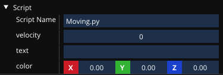
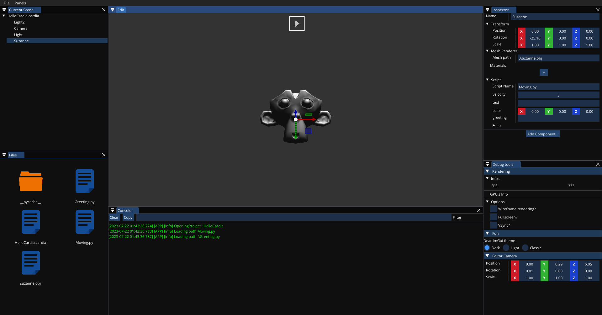

# Cardia Engine

Cardia is a C++20 game engine that uses python as its scripting language.

The initial aim was primarily educational, to learn game engine programming,
but eventually evolved into an open source project with the intention of
releasing a game with it.

## Features

### Python scripting :

Cardia integrates a scripting system using Python.

Scripts are attached to entities, and reflection allows fields to be simply
modified in real time from within the editor.

For example, the following script can be attached to an entity:
```python
class Moving(Behavior):
    velocity: int
    _tick_count: float
    text: str
    color: Vector3
```

And then, from the editor, the "public" fields can be modified:



### Editor :

Cardia comes with an editor, CardiaTor, which lets you create and edit scenes,
and modify entities and their components. Its long-term aim is to provide a
whole set of tools to make life easier for engine users, although for the moment
it remains very simple.  It takes inspiration from the Unity editor, and is written in C++ using the
[Dear ImGui](https://github.com/ocornut/imgui) library.



### Entity-Component-System :

Cardia uses an ECS architecture, which allows for a lot of flexibility and
performance. The ECS is implemented using the [EnTT](https://github.com/skypjack/entt)
library. The ECS is exposed to python, allowing for easy creation of new components.

### Rendering :

Cardia uses Vulkan for rendering, mainly for it being a modern API, and for its
precise control over the rendering pipeline.
